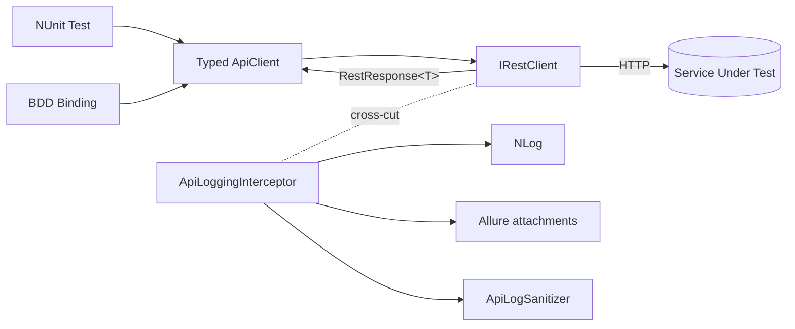

# API Testing Architecture

Reference for the API testing layer in `CsharpTestAutomation.Framework` (namespace `CsharpTestAutomation.Framework.API`). The layer wraps [RestSharp](https://restsharp.dev/) with consistent serialization, sanitized/truncated logging, Allure attachments, and a small set of chainable assertions. Typed clients consume RestSharp's `IRestClient` directly — the framework does **not** own a request/execution/response abstraction; tests assert on RestSharp's native `RestResponse` / `RestResponse<T>`.

> The interceptor overrides
> `BeforeRequest(RestRequest, CancellationToken)` / `AfterRequest(RestResponse, CancellationToken)`,
> reads request headers from `RestResponse.MergedParameters`, response headers from
> `Headers` + `ContentHeaders`, and the request body from `RestRequest.Parameters`
> (`ParameterType.RequestBody`).

## 1. Data Flow



`Test → TypedApiClient → IRestClient → HTTP`, with `ApiLoggingInterceptor` registered on the `IRestClient` as a cross-cutting concern. `new RestClientFactory(coreConfiguration.Api)` builds the factory from `ApiSettings` (the factory internally wires sanitizer → interceptor), and `RestClientFactory.Create("<service>", authenticator?)` builds the `IRestClient` from `ApiSettings`, wiring System.Text.Json serialization (`JsonExtensions.DefaultOptions`) and the interceptor.

The **suggested** typed-client pattern injects the `IRestClientFactory`, creates and owns its `IRestClient` (keeping the service name internal), and implements `IDisposable`. Typed clients build a `RestRequest` and call `client.ExecuteAsync<T>(...)`, returning RestSharp's native `RestResponse<T>`.

## 2. Component Table

| Type | Responsibility |
| --- | --- |
| `ApiSettings` / `ApiServiceSettings` / `ApiLoggingSettings` | Configuration bound from the `Api` key in `appsettings.json`. `ApiServiceSettings.Validate(name)` and `ApiLoggingSettings.Validate()` fail fast on empty/invalid `BaseUrl`, non-positive `TimeoutSeconds`, or non-positive `MaxBodySizeBytes`. |
| `IRestClientFactory` / `RestClientFactory` | Creates configured `IRestClient` instances per named service. Construct via `new RestClientFactory(apiSettings, proxy?)`, passing `CoreConfiguration.Api` as the settings. Internally wires `ApiLogSanitizer` → `ApiLoggingInterceptor`, validates settings, applies an optional **explicit** `IWebProxy` (proxy is opt-in and not derived from `ProxyMode`/`ProxyServer`), accepts an optional client-wide `IAuthenticator`, and sets `ThrowOnAnyError=false` + `FailOnDeserializationError=true`. Both opt into `#nullable enable`, so the optional `IWebProxy?` / `IAuthenticator?` parameters are explicitly annotated. |
| Typed API client | Consuming-project class (for example, the illustrative `ExampleApiClient`). The **suggested** shape injects an `IRestClientFactory`, creates and **owns** its `IRestClient` (service name held as a private `const`), implements `IDisposable` (`(_client as IDisposable)?.Dispose()`), builds `RestRequest`s, and returns RestSharp's native `RestResponse` / `RestResponse<T>`. No framework base class. |
| `ApiTestBase` (Tests project) | **Mandatory** NUnit base class for every API fixture in `CsharpTestAutomation.Tests` — this is the reason the class exists, so a plain `[TestFixture]` is never used for API tests even when a fixture does not need `RequireDbData`. Builds the shared `RestClientFactory` from `CoreConfiguration.Api` in setup and exposes `NetBoxAuthenticator`, `RequireDbData<T>`, and `RegisterClient`/`GetClient<T>` (thin wrappers around `TestContainer.Register`/`Get` that give disposable typed clients correct, cleanup-ordered disposal without fixtures touching `TestContainer` directly). Not part of the framework. |
| `IApiLogSanitizer` / `ApiLogSanitizer` | Redacts sensitive headers and JSON body fields when enabled; never throws. Used **only** by the logging interceptor. |
| `ApiHeaderExtractor` / `ApiBodyFormatter` | Read request/response headers and bodies from the RestSharp `RestResponse` for logging; never mutate it. |
| `ApiLogEntry` | Behavior-free snapshot of one call. |
| `ApiLoggingInterceptor` | RestSharp interceptor: the sole place that sanitizes, truncates, and **pretty-prints** (JSON / XML / URL-encoded form) bodies before logging to NLog and attaching request/response to Allure. |
| `ApiAssertions` | A deliberately **minimal** set of chainable, NUnit-compatible assertion extensions over RestSharp's native `RestResponse` / `RestResponse<T>`: `ShouldHaveCompletedTransport` (transport-level success) and token-aware `ShouldHaveJsonPathValue`. For status codes, headers, content type, and deserialized payloads, assert directly on the `RestResponse` with **AwesomeAssertions** / **AwesomeAssertions.Json**. |

### Application execution and lifetime

Application code is independent in `CsharpTestAutomation.Tests` and
`CsharpTestAutomation.Bdd.Tests`; both reference the reusable framework.
Clients, builders, response contracts, SQL aliases, assertion boundaries,
data ownership, and LIFO cleanup follow the shared rules in both projects.
Do not reference one application test assembly from the other.

| Approach | Setup and state | Teardown and reporting |
| --- | --- | --- |
| NUnit | `ApiTestBase` builds the factory/authenticator; `OnSetUpAsync` registers scenario clients through `RegisterClient`. Fixture state is per test. | `TestBase` runs the inherited cleanup stack before disposing the test container. Allure.NUnit uses fixture/test attributes. |
| BDD | `CommonHooks` registers typed state and one cleanup/lifecycle owner. `ScenarioHooks` sets metadata, creates a scenario client, registers its release, and injects borrowed instances with `dispose:false`. | `ScenarioLifecycle` attempts failure evidence, then LIFO data cleanup, then reverse resource release. Hooks preserve the primary error and fail a passing body when cleanup/release fails. Allure.Reqnroll emits the scenario result after hooks. |

BDD run services own configuration, controlled API token initialization, and the
asynchronous PostgreSQL pool. Clients remain scenario-owned; API-only execution
does not initialize browser authentication. Bindings keep native RestSharp
responses in typed state and assert status before extracting payloads or querying
persistence. `Then` bindings own behavior assertions.

BDD step definitions use `Steps/API/<App>/` and the `Steps` suffix. `SiteApiSteps`
contains prerequisite creation, API actions, persistence assertions, and owned-ID
cleanup. `SiteUiSteps` contains UI actions and pre-submission lookup cleanup;
it shares the small ID-deletion operation from the API step file. There is no
separate workflow-helper layer in BDD. The NUnit workflow layer below remains
independent of Reqnroll.

See [BDD rules](../.agents/rules/bdd-testing.md) and the
[BDD project scope](../CsharpTestAutomation.Bdd.Tests/AGENTS.md) for the eight product cases.

### NUnit Test-Data Preconditions

API tests that depend on environment data use `ApiTestBase.RequireDbData` to mark an unavailable candidate as inconclusive. This keeps the test body focused on the API behavior and gives Allure a consistent broken/inconclusive result when an environment cannot provide the required fixture.

```csharp
Guid resourceId = RequireDbData<Guid>(
 ResourceQueries.SelectAll().FirstOrDefault()?.Id,
 "No resource records exist in this environment.");
```

Use `RequireDbData<T>(object? candidate, string missingDataMessage)` for nullable single query results, including nullable value types such as `Guid?`. Pass the query result directly; do not manually check for null and call `Assert.Inconclusive(...)`. For collection queries, use `RequireDbData<T>(IReadOnlyCollection<T>? candidates, string missingDataMessage)`, which marks null or empty collections inconclusive and returns a random row. These helpers are in the application test project, not the reusable framework.

Read the [shared test rules](../.agents/rules/test-automation.md) for data
ownership and cleanup, and the [API rules](../.agents/rules/api-testing.md)
for fixture registration, missing seed data, request builders, and API assertions.

## 3. Adding a New Typed API Client

> **Suggested pattern — factory-owned, disposable client.** Inject the `IRestClientFactory` (not a
> pre-built `IRestClient`), create and own the `IRestClient` inside the client, and implement
> `IDisposable`. This keeps the service name an implementation detail, gives a single owner for the
> client lifetime, and lets a test hold **one field per client** instead of a parallel `IRestClient`
> field. The `ExampleApiClient` and `SecureApiClient` names below are illustrative templates, not
> repository files.

1. Add the service `BaseUrl` + `TimeoutSeconds` under `Api.Services.<name>` in `CsharpTestAutomation.Tests/appsettings.json`.
2. Create `API/Clients/<Name>ApiClient.cs` as a thin wrapper that takes an `IRestClientFactory` (a primary-constructor parameter) and creates its client in a `private readonly IRestClient _client` field initializer: `factory.Create(ServiceName)` — there is no base class. Keep the service name in a `private const string ServiceName`.
3. Add typed methods that build a `RestRequest` and call `_client.ExecuteAsync<TDto>(...)`, returning `Task<RestResponse<TDto>>`.
4. Implement `IDisposable` with `public void Dispose() => (_client as IDisposable)?.Dispose();` (RestSharp's `IRestClient` is not `IDisposable` — only the concrete `RestClient` is — so the cast is required and null-safe). The class is `sealed` with no finalizer, so no `GC.SuppressFinalize` is needed. Note: `RestClientFactory` itself does not implement `IDisposable` and must not be disposed; only the `IRestClient` instances it creates require disposal.
5. Create DTOs in `API/DTOs/<Resource>/` as `record` types with `[JsonPropertyName]` (see Section 5).
6. Add a DTO builder in `API/Factories/` when tests need to construct request payloads.
7. Write tests in `Tests/API/<Name>ApiTests.cs`.

> **Folder vs namespace casing.** Folders are upper-case (`API/Clients/`, `API/DTOs/`,
> `API/Factories/`); namespaces are Pascal-case (`CsharpTestAutomation.Tests.Api.Clients`,
> `CsharpTestAutomation.Tests.Api.Dtos`, `CsharpTestAutomation.Tests.Api.Factories`). This is intentional
> and analyzer-clean — `dotnet_style_namespace_match_folder` compares case-insensitively. Do not
> "correct" either form.

## 4. Adding a New NUnit API Test

Every API test fixture derives from `ApiTestBase` (never a plain `[TestFixture]`). This is the
single reason `ApiTestBase` exists: it supplies the shared `RestClientFactory`, `NetBoxAuthenticator`,
`RequireDbData`, and — via its own base `TestBase` — the `ScenarioCleanupActions` wiring and the
`RegisterClient`/`GetClient` helpers (see below) that every fixture needs, regardless of whether a
given test happens to use `RequireDbData`.

1. Class-level: `[AllureSuite]`, `[AllureFeature]` (`[AllureNUnit]`/`[TestFixture]`/`[Category("API")]`
  are already applied by `TestBase`/`ApiTestBase` and must not be repeated). Test-level: `[Test]`,
  `[AllureStory]`, `[AllureSeverity]`, `[AllureOwner]`.
2. Override `OnSetUpAsync()` (calling `await base.OnSetUpAsync()` first, which builds
  `RestClientFactory`) to construct each typed client from the inherited `RestClientFactory` and
  `NetBoxAuthenticator`.
3. **Register each disposable typed client with `ApiTestBase.RegisterClient(...)`** instead of
  holding a plain field, and expose it to test methods through a computed property backed by
  `ApiTestBase.GetClient<T>()`:

  ```csharp
  private FooApiClient FooClient => GetClient<FooApiClient>();

  protected override async Task OnSetUpAsync()
  {
      await base.OnSetUpAsync();
      RegisterClient(new FooApiClient(RestClientFactory, NetBoxAuthenticator));
  }
  ```

  `RegisterClient`/`GetClient` are thin wrappers `ApiTestBase` puts around
  `TestContainer.Register`/`Get` — a fixture never calls `TestContainer` itself. This matters for two
  reasons:

- `TestBase.TearDownAsync()` runs `ScenarioCleanupActions.CleanUpAsync()` **before**
    `TestContainer.DisposeServicesAsync()`, so a client registered this way is disposed only *after*
    the cleanup actions that call it (e.g. a delete) have run — never before.
- A plain disposable field triggers the `NUnit1032` analyzer (since nothing in this class's own
    `[TearDown]` disposes it — the container does, in the base class, after teardown returns). A
    property computed from `GetClient<T>()` is not itself a disposable field, so the analyzer has
    nothing to flag. Suppressing the analyzer instead is not an option in this repository.
  `RestClientFactory` is **not** `IDisposable` — never dispose or register it.

1. Register cleanup via the inherited `ScenarioCleanupActions.AddCleanUpAction(...)`, not a
  locally-constructed `ScenarioCleanupActions` instance.
2. Assert on the returned `RestResponse<T>` with **AwesomeAssertions**. Use the minimal `ApiAssertions`
  extensions only for transport status (`ShouldHaveCompletedTransport`) and JSONPath
  (`ShouldHaveJsonPathValue`).

For test design, names, attributes, assertions, data, and completion, read the
[shared test rules](../.agents/rules/test-automation.md). The
[API rules](../.agents/rules/api-testing.md) own API authoring requirements.

### Reusable API Steps

Reusable prerequisite chains and API workflows live in `Steps/API/<App>/`,
with namespace `CsharpTestAutomation.Tests.Steps.Api.<App>` and class names
such as `DeviceSteps`. Both API and UI fixtures can call API steps. Steps
borrow the fixture's registered clients and cleanup stack, register cleanup
when resources are created, and leave behavior assertions in the tests.
Keep step-result records beside their steps. Request construction stays in
typed clients, payload building in `API/Factories/`, and generated values in
`TestData/`. See the authoring rules for the full steps convention.

## 5. DTO Conventions

DTOs live in `CsharpTestAutomation.Tests/API/DTOs/` and are organized by **resource** — one sub-folder per API resource group. This keeps all shapes for a feature in one place rather than splitting them across generic `Requests/` and `Responses/` buckets.

```text
API/DTOs/
 Resources/
  ResourceListItemDto.cs <- GET /api/resources (list item)
  ResourceDetailDto.cs   <- GET /api/resources/{id}
  CreateResourceDto.cs   <- POST /api/resources request body
 Categories/
  CategoryDto.cs
 Labels/
  LabelDto.cs
  Users/
    UserDto.cs
  MasterData/
    CountryDto.cs
```

**Naming rules:**

| Pattern | Example | When to use |
| --- | --- | --- |
| `{Resource}ListItemDto` | `ResourceListItemDto` | Collection / list response item |
| `{Resource}DetailDto` | `ResourceDetailDto` | Single-resource GET response |
| `Create{Resource}Dto` | `CreateResourceDto` | POST request body (current repository convention) |
| `Update{Resource}Dto` | `UpdateResourceDto` | PUT / PATCH request body |
| `{Resource}Dto` | `CategoryDto`, `LabelDto` | Simple sub-resource response with no list/detail distinction |

Avoid generic suffixes such as `Response` or `Dto` alone on top-level resources — the name should communicate which endpoint it represents.

Do **not** namespace DTOs under the typed-client namespace; the `Api.Dtos.<Resource>` namespace (e.g. `CsharpTestAutomation.Tests.Api.Dtos.Resources`) keeps them independently reusable across multiple clients.

### DTO Builders

Request payloads are constructed through builders in `API/Factories/` rather than inline in tests. Builders derive from `BaseBuilder<T>` and are NBuilder-backed:

```csharp
public class CreateResourceDtoBuilder : BaseBuilder<CreateResourceDto>
```

A builder supplies valid defaults for every required field so a test overrides only the field under test. This keeps negative-path tests readable — the deviation from valid is the only thing visible in the test body.

## 6. Authentication

Authentication uses **RestSharp's native model** directly — the framework does not wrap it in custom provider types.

**JWT / OAuth-style tokens** use a RestSharp `IAuthenticator` (for example `JwtAuthenticator`). Pass it into `RestClientFactory.Create("<service>", authenticator)`, which assigns it to `RestClientOptions.Authenticator`, so it applies to every request the client makes.

**API keys are ordinary headers.** Add them per request with `RestRequest.AddOrUpdateHeader(name, value)`.

| Scenario | Approach |
| --- | --- |
| Public / unauthenticated service | Create the client without an authenticator (`Create("<service>")`) |
| Bearer / JWT token | Pass `new JwtAuthenticator(token)` to `Create("<service>", authenticator)` |
| API key header (e.g. `X-Api-Key`) | `request.AddOrUpdateHeader("X-Api-Key", value)` |
| JWT **and** API key together | Client-wide authenticator + per-request `AddOrUpdateHeader(...)` |
| NetBox API token | `NetBoxTokenAuthenticator.Default` from `ApiTestBase.NetBoxAuthenticator` (see below) |

**Per-request control (negative tests).** RestSharp lets a request override the client-wide authenticator by assigning `RestRequest.Authenticator`:

- A different `IAuthenticator` (e.g. `new JwtAuthenticator(otherToken)`) supplies alternate credentials for that request only.
- The framework's no-op `AnonymousAuthenticator.Instance` disables the client-wide authenticator for that request, so you can assert `401`/`403` responses. (Assigning `null` does **not** suppress auth — RestSharp falls back to the client-wide authenticator.)

The resulting auth header flows through `MergedParameters` and is redacted by `ApiLogSanitizer` when redaction is enabled (see the Redaction section).

### Worked Example — API key with optional client-wide JWT

`SecureApiClient` stores the key locally and applies it when building each request, while accepting an optional client-wide authenticator and a per-request override:

```csharp
public sealed class SecureApiClient(IRestClientFactory factory, IAuthenticator? authenticator = null)
    : IDisposable
{
    private const string ServiceName = "postmanecho";
    private const string ApiKeyHeaderName = "X-Api-Key";

    private readonly IRestClient _client = factory.Create(ServiceName, authenticator);
    private string? _apiKey;

    public void SetApiKey(string apiKey) => _apiKey = apiKey;

    public void ClearApiKey() => _apiKey = null;

    public Task<RestResponse<EchoResponse>> GetEchoAsync(
        IAuthenticator? requestAuthenticator = null,
        CancellationToken ct = default)
    {
        var request = new RestRequest("/get", Method.Get);

        if (_apiKey is not null)
        {
            request.AddOrUpdateHeader(ApiKeyHeaderName, _apiKey);
        }

        request.Authenticator = requestAuthenticator;

        return _client.ExecuteAsync<EchoResponse>(request, ct);
    }

    public void Dispose() => (_client as IDisposable)?.Dispose();
}
```

### NetBox API token (application flow)

NetBox authentication is independent of the UI login. `NetBoxAuthClient` provisions a token through `POST users/tokens/provision/` using the configured username and password. `NetBoxSession` uses a configured token when present or lazily caches the provisioned token for the run. `NetBoxTokenAuthenticator` applies it to requests using NetBox's configured `Authorization: Token <value>` scheme.

`ApiTestBase` exposes `NetBoxAuthenticator => NetBoxTokenAuthenticator.Default` and builds the shared `RestClientFactory` from `CoreConfiguration.Api` in setup. `NetBoxTokenAuthenticator.Default` is the single owner of `new NetBoxTokenAuthenticator(NetBoxSession.Default)` — construct the authenticator this way everywhere rather than restating the expression. A typed client receives this authenticator when it is constructed, so each request receives the token header. Provisioning request and response content is not sent through the API logging interceptor. API request headers pass through the configured sanitizer; sensitive values are redacted only when `Api.Logging.RedactSensitiveData` is `true`.

NetBox-specific token provisioning lives in `CsharpTestAutomation.Tests`; the framework supplies only RestSharp's `IAuthenticator` plumbing and owns no NetBox credentials or token provisioning logic.

> A framework-level OAuth2 / client-credentials `IAuthenticator` (token fetched from a token endpoint
> rather than a UI login) remains out of scope.

## 7. Logging and Allure

Every API call is logged to **NLog** by `ApiLoggingInterceptor`, regardless of Allure settings:

```text
[API] {METHOD} {resource} → {statusCode} | {elapsedMs}ms
```

Log level: `Info` for 2xx, `Warn` for 4xx, `Error` for 5xx or a transport exception.

**Allure attachments** are produced when `Api.Logging.AttachToAllure` is `true` and either `AttachOnFailureOnly` is `false` (every call) or the call failed. The default is failure-only. When produced, two `text/plain` attachments are added:

- `API Request - {METHOD} {resource}`
- `API Response - {statusCode} {METHOD} {resource}`

Attachment content is redacted when `Api.Logging.RedactSensitiveData` is set to `true`. Full request/response detail in NLog is disabled by default; if enabled, it uses the same configured sanitization. Bodies are truncated to `MaxBodySizeBytes` with a `[TRUNCATED]` suffix and then **pretty-printed**: JSON is indented, XML is indented, and URL-encoded form data is rendered as `key: value` lines. Pretty-printing runs after truncation, so a truncated JSON fragment that no longer parses is emitted as-is.

Sanitization, truncation, and formatting apply **only** to log/Allure output — the `RestResponse` returned to tests always holds the raw, untruncated response, so assertions run against exactly what the server sent.

> For manual replay of a request, use the service's Postman collection rather than reconstructing
> a command from the logs.

## 8. Redaction

`appsettings.json` sets redaction **off** for API log and Allure content. The `ApiLoggingSettings` model defaults it to `true` when the setting is omitted. When enabled, sensitive values are replaced with `***REDACTED***` before they are retained. Set `Api.Logging.RedactSensitiveData` to `true` to redact them.

**Default redacted headers** (case-insensitive): `Authorization`, `Proxy-Authorization`, `Cookie`, `Set-Cookie`.

**Default redacted body fields** (case-insensitive, recursive): `password`, `token`, `access_token`, `refresh_token`, `id_token`, `api_key`, `apikey`, `client_secret`, `secret`.

**Extend** the body field list via `Api.Logging.AdditionalRedactedFields` in `appsettings.json`; configured names are appended to the built-in list at construction time (applied only when `RedactSensitiveData` is `true`).

## 9. Configuration Reference

Bound from the `Api` key in `CsharpTestAutomation.Tests/appsettings.json`.

### `ApiSettings`

| Key | Type | Default | Description |
| --- | --- | --- | --- |
| `Services` | `IDictionary<string, ApiServiceSettings>` | `{}` | Named services keyed by logical service name (matched by typed clients). |
| `Logging` | `ApiLoggingSettings` | `new()` | Logging and Allure attachment behavior. |

### `ApiServiceSettings`

| Key | Type | Default | Description |
| --- | --- | --- | --- |
| `BaseUrl` | `string` | `""` (required) | Absolute base URL of the service. Validated at client creation: must be a non-empty absolute URI. |
| `TimeoutSeconds` | `int` | `30` | Request timeout applied to the underlying HTTP client. Validated to be greater than zero. |

### `ApiLoggingSettings`

| Key | Type | Default | Description |
| --- | --- | --- | --- |
| `AttachToAllure` | `bool` | `true` | Attach request/response to the Allure report. |
| `AttachOnFailureOnly` | `bool` | `true` | When `true`, attach only for failed calls; when `false`, attach for every call. |
| `MaxBodySizeBytes` | `int` | `15000` | Max body bytes retained before truncation **in logs/attachments only** (the `RestResponse` keeps the raw body). Validated to be greater than zero. |
| `LogFullDetail` | `bool` | `false` | When `true`, write full request/response details at Debug level after configured sanitization. |
| `RedactSensitiveData` | `bool` | `false` in `appsettings.json` (model fallback: `true`) | When `true`, redact sensitive headers/body fields before logging and attachment. |
| `AdditionalRedactedFields` | `IList<string>` | `[]` | Extra JSON field names appended to the built-in body redaction list (used only when `RedactSensitiveData` is `true`). |

### Example

```json
{
  "Api": {
    "Services": {
      "jsonplaceholder": {
        "BaseUrl": "https://jsonplaceholder.typicode.com",
        "TimeoutSeconds": 30
      }
    },
    "Logging": {
      "AttachToAllure": true,
      "AttachOnFailureOnly": true,
      "MaxBodySizeBytes": 15000,
      "LogFullDetail": false,
      "RedactSensitiveData": false,
      "AdditionalRedactedFields": []
    }
  }
}
```

## 10. Revision History

Newest first. Bump the version and add a row whenever this document changes so future updates are easy to track. Keep maximum three rows, delete the rest.

| Version | Date | Summary |
| --- | --- | --- |
| 1.10 | 2026-09-27 | Document NetBox token authentication and clarify API logging configuration. |
| 1.9 | 2026-09-27 | Replace application-specific examples with generic resource templates. |
| 1.8 | 2026-09-27 | Bootstrap waits for the MSAL token. The factory owns the browser context. |
