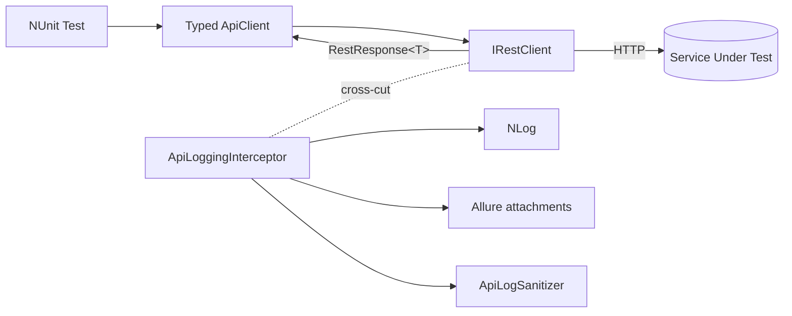

# API Testing Architecture

Reference for the API testing layer in `CsharpTestAutomation.Framework` (namespace `CsharpTestAutomation.Framework.API`). The layer wraps [RestSharp](https://restsharp.dev/) with consistent serialization, sanitized/truncated logging, Allure attachments, and a small set of chainable assertions. Typed clients consume RestSharp's `IRestClient` directly — the framework does **not** own a request/execution/response abstraction; tests assert on RestSharp's native `RestResponse` / `RestResponse<T>`.

> The interceptor overrides
> `BeforeRequest(RestRequest, CancellationToken)` / `AfterRequest(RestResponse, CancellationToken)`,
> reads request headers from `RestResponse.MergedParameters`, response headers from
> `Headers` + `ContentHeaders`, and the request body from `RestRequest.Parameters`
> (`ParameterType.RequestBody`).

## 1. Data Flow



`Test → TypedApiClient → IRestClient → HTTP`, with `ApiLoggingInterceptor` registered on the `IRestClient` as a cross-cutting concern. `new RestClientFactory(coreConfiguration.Api)` builds the factory from `ApiSettings` (the factory internally wires sanitizer → interceptor), and `RestClientFactory.Create("<service>", authenticator?)` builds the `IRestClient` from `ApiSettings`, wiring System.Text.Json serialization (`JsonExtensions.DefaultOptions`) and the interceptor.

The **suggested** typed-client pattern injects the `IRestClientFactory`, creates and owns its `IRestClient` (keeping the service name internal), and implements `IDisposable`. Typed clients build a `RestRequest` and call `client.ExecuteAsync<T>(...)`, returning RestSharp's native `RestResponse<T>`.

## 2. Component Table

| Type | Responsibility |
| --- | --- |
| `ApiSettings` / `ApiServiceSettings` / `ApiLoggingSettings` | Configuration bound from the `Api` key in `appsettings.json`. `ApiServiceSettings.Validate(name)` and `ApiLoggingSettings.Validate()` fail fast on empty/invalid `BaseUrl`, non-positive `TimeoutSeconds`, or non-positive `MaxBodySizeBytes`. |
| `IRestClientFactory` / `RestClientFactory` | Creates configured `IRestClient` instances per named service. Construct via `new RestClientFactory(apiSettings, proxy?)`, passing `CoreConfiguration.Api` as the settings. Internally wires `ApiLogSanitizer` → `ApiLoggingInterceptor`, validates settings, applies an optional **explicit** `IWebProxy` (proxy is opt-in and not derived from `ProxyMode`/`ProxyServer`), accepts an optional client-wide `IAuthenticator`, and sets `ThrowOnAnyError=false` + `FailOnDeserializationError=true`. Both opt into `#nullable enable`, so the optional `IWebProxy?` / `IAuthenticator?` parameters are explicitly annotated. |
| Typed API client | Consuming-project class (for example, `CpfAppApiClient`). The **suggested** shape injects an `IRestClientFactory`, creates and **owns** its `IRestClient` (service name held as a private `const`), implements `IDisposable` (`(_client as IDisposable)?.Dispose()`), builds `RestRequest`s, and returns RestSharp's native `RestResponse` / `RestResponse<T>`. No framework base class. |
| `ApiTestBase` (Tests project) | Optional NUnit base class for API fixtures in `CsharpTestAutomation.Tests`. Builds the shared `RestClientFactory` from `CoreConfiguration.Api` in setup and exposes `BootstrapAuthenticator` (a `JwtAuthenticator` over the UI-bootstrapped token) and `RequireDbData<T>`. Not part of the framework. |
| `IApiLogSanitizer` / `ApiLogSanitizer` | Redacts sensitive headers and JSON body fields by default; never throws. Used **only** by the logging interceptor. |
| `ApiHeaderExtractor` / `ApiBodyFormatter` | Read request/response headers and bodies from the RestSharp `RestResponse` for logging; never mutate it. |
| `ApiLogEntry` | Behavior-free snapshot of one call. |
| `ApiLoggingInterceptor` | RestSharp interceptor: the sole place that sanitizes, truncates, and **pretty-prints** (JSON / XML / URL-encoded form) bodies before logging to NLog and attaching request/response to Allure. |
| `ApiAssertions` | A deliberately **minimal** set of chainable, NUnit-compatible assertion extensions over RestSharp's native `RestResponse` / `RestResponse<T>`: `ShouldHaveCompletedTransport` (transport-level success) and token-aware `ShouldHaveJsonPathValue`. For status codes, headers, content type, and deserialized payloads, assert directly on the `RestResponse` with **AwesomeAssertions** / **AwesomeAssertions.Json**. |

### Test-Data Preconditions

API tests that depend on environment data use `ApiTestBase.RequireDbData` to mark an unavailable candidate as inconclusive. This keeps the test body focused on the API behavior and gives Allure a consistent broken/inconclusive result when an environment cannot provide the required fixture.

```csharp
Guid cpfId = RequireDbData<Guid>(
    CpfQueries.SelectAllCpfs().FirstOrDefault()?.Id,
    "No CPF records exist in this environment.");
```

Use `RequireDbData<T>(object? candidate, string missingDataMessage)` for nullable single query results, including nullable value types such as `Guid?`. Pass the query result directly; do not manually check for null and call `Assert.Inconclusive(...)`. For collection queries, use `RequireDbData<T>(IReadOnlyCollection<T>? candidates, string missingDataMessage)`, which marks null or empty collections inconclusive and returns a random row. These helpers are in the application test project, not the reusable framework.

The full test-data policy (read-only seeded data, inconclusive missing prerequisites, and cleanup for test-owned records) lives in `.agents/rules/test-automation.md`.

## 3. Adding a New Typed API Client

> **Suggested pattern — factory-owned, disposable client.** Inject the `IRestClientFactory` (not a
> pre-built `IRestClient`), create and own the `IRestClient` inside the client, and implement
> `IDisposable`. This keeps the service name an implementation detail, gives a single owner for the
> client lifetime, and lets a test hold **one field per client** instead of a parallel `IRestClient`
> field. See `CsharpTestAutomation.Tests/API/Clients/CpfAppApiClient.cs` for the repository's
> factory-owned client and `CsharpTestAutomation.Tests/Tests/API/GetCpfsTests.cs` for its
> authenticated use. The `SecureApiClient` snippet below is illustrative and is not a repository file.

1. Add the service `BaseUrl` + `TimeoutSeconds` under `Api.Services.<name>` in `CsharpTestAutomation.Tests/appsettings.json`.
2. Create `API/Clients/<Name>ApiClient.cs` as a thin wrapper that takes an `IRestClientFactory` (a primary-constructor parameter) and creates its client in a `private readonly IRestClient _client` field initializer: `factory.Create(ServiceName)` — there is no base class. Keep the service name in a `private const string ServiceName`.
3. Add typed methods that build a `RestRequest` and call `_client.ExecuteAsync<TDto>(...)`, returning `Task<RestResponse<TDto>>`.
4. Implement `IDisposable` with `public void Dispose() => (_client as IDisposable)?.Dispose();` (RestSharp's `IRestClient` is not `IDisposable` — only the concrete `RestClient` is — so the cast is required and null-safe). The class is `sealed` with no finalizer, so no `GC.SuppressFinalize` is needed. Note: `RestClientFactory` itself does not implement `IDisposable` and must not be disposed; only the `IRestClient` instances it creates require disposal.
5. Create DTOs in `API/DTOs/<Resource>/` as `record` types with `[JsonPropertyName]` (see Section 5).
6. Add a DTO builder in `API/Factories/` when tests need to construct request payloads.
7. Write tests in `Tests/API/<Name>ApiTests.cs`.

> **Folder vs namespace casing.** Folders are upper-case (`API/Clients/`, `API/DTOs/`,
> `API/Factories/`); namespaces are Pascal-case (`CsharpTestAutomation.Tests.Api.Clients`,
> `CsharpTestAutomation.Tests.Api.Dtos`, `CsharpTestAutomation.Tests.Api.Factories`). This is intentional
> and analyzer-clean — `dotnet_style_namespace_match_folder` compares case-insensitively. Do not
> "correct" either form.

## 4. Adding a New API Test

Plain NUnit `[TestFixture]` — no base class required, or derive from `ApiTestBase` when you need `RequireDbData` or `BootstrapAuthenticator`.

1. Class-level: `[AllureNUnit]`, `[AllureSuite]`, `[AllureFeature]`. Test-level: `[Test]`, `[AllureStory]`.
2. In `[SetUp]`, build one `IRestClientFactory` via `new RestClientFactory(config.Api)` and pass it to each typed client's constructor. The client creates and owns its own `IRestClient`.
3. Hold **one field per client** and dispose each in `[TearDown]` via `_client.Dispose()`. With several clients in one fixture, share the single factory and dispose each client. `RestClientFactory` is **not** `IDisposable` — never dispose the factory.
4. Assert on the returned `RestResponse<T>` with **AwesomeAssertions**. Use the minimal `ApiAssertions` extensions only for transport status (`ShouldHaveCompletedTransport`) and JSONPath (`ShouldHaveJsonPathValue`).

For test-case design, naming, required attributes, assertion style, test data, and Definition of Done, see `.agents\rules\test-automation.md`. Those rules apply to every test in the project and are not restated here.

## 5. DTO Conventions

DTOs live in `CsharpTestAutomation.Tests/API/DTOs/` and are organized by **resource** — one sub-folder per API resource group. This keeps all shapes for a feature in one place rather than splitting them across generic `Requests/` and `Responses/` buckets.

```text
API/DTOs/
  Cpfs/
    CpfListItemDto.cs      ← GET /api/cpfs (list item)
    CpfDetailDto.cs        ← GET /api/cpfs/{id}
    CreateCpfDto.cs        ← POST /api/cpfs request body
  Outcomes/
    OutcomeDto.cs
  Risks/
    RiskDto.cs
  Users/
    UserDto.cs
  MasterData/
    CountryDto.cs
```

**Naming rules:**

| Pattern | Example | When to use |
| --- | --- | --- |
| `{Resource}ListItemDto` | `CpfListItemDto` | Collection / list response item |
| `{Resource}DetailDto` | `CpfDetailDto` | Single-resource GET response |
| `Create{Resource}Dto` | `CreateCpfDto` | POST request body (current repository convention) |
| `Update{Resource}Dto` | `UpdateCpfDto` | PUT / PATCH request body |
| `{Resource}Dto` | `OutcomeDto`, `RiskDto` | Simple sub-resource response with no list/detail distinction |

Avoid generic suffixes such as `Response` or `Dto` alone on top-level resources — the name should communicate which endpoint it represents.

Do **not** namespace DTOs under the typed-client namespace; the `Api.Dtos.<Resource>` namespace (e.g. `CsharpTestAutomation.Tests.Api.Dtos.Cpfs`) keeps them independently reusable across multiple clients.

### DTO Builders

Request payloads are constructed through builders in `API/Factories/` rather than inline in tests. Builders derive from `BaseBuilder<T>` and are NBuilder-backed:

```csharp
public class CreateCpfDtoBuilder : BaseBuilder<CreateCpfDto>
```

A builder supplies valid defaults for every required field so a test overrides only the field under test. This keeps negative-path tests readable — the deviation from valid is the only thing visible in the test body.

## 6. Authentication

Authentication uses **RestSharp's native model** directly — the framework does not wrap it in custom provider types.

**JWT / OAuth-style tokens** use a RestSharp `IAuthenticator` (for example `JwtAuthenticator`). Pass it into `RestClientFactory.Create("<service>", authenticator)`, which assigns it to `RestClientOptions.Authenticator`, so it applies to every request the client makes.

**API keys are ordinary headers.** Add them per request with `RestRequest.AddOrUpdateHeader(name, value)`.

| Scenario | Approach |
| --- | --- |
| Public / unauthenticated service | Create the client without an authenticator (`Create("<service>")`) |
| Bearer / JWT token | Pass `new JwtAuthenticator(token)` to `Create("<service>", authenticator)` |
| API key header (e.g. `X-Api-Key`) | `request.AddOrUpdateHeader("X-Api-Key", value)` |
| JWT **and** API key together | Client-wide authenticator + per-request `AddOrUpdateHeader(...)` |
| Entra ID / MSAL bearer (UI-bootstrapped) | `new JwtAuthenticator(BootstrapSession.Default.Token)` from `ApiTestBase.BootstrapAuthenticator` (see below) |

**Per-request control (negative tests).** RestSharp lets a request override the client-wide authenticator by assigning `RestRequest.Authenticator`:

- A different `IAuthenticator` (e.g. `new JwtAuthenticator(otherToken)`) supplies alternate credentials for that request only.
- The framework's no-op `AnonymousAuthenticator.Instance` disables the client-wide authenticator for that request, so you can assert `401`/`403` responses. (Assigning `null` does **not** suppress auth — RestSharp falls back to the client-wide authenticator.)

The resulting auth header flows through `MergedParameters` and is redacted by `ApiLogSanitizer` when redaction is enabled (see the Redaction section).

### Worked Example — API key with optional client-wide JWT

`SecureApiClient` stores the key locally and applies it when building each request, while accepting an optional client-wide authenticator and a per-request override:

```csharp
public sealed class SecureApiClient(IRestClientFactory factory, IAuthenticator? authenticator = null)
    : IDisposable
{
    private const string ServiceName = "postmanecho";
    private const string ApiKeyHeaderName = "X-Api-Key";

    private readonly IRestClient _client = factory.Create(ServiceName, authenticator);
    private string? _apiKey;

    public void SetApiKey(string apiKey) => _apiKey = apiKey;

    public void ClearApiKey() => _apiKey = null;

    public Task<RestResponse<EchoResponse>> GetEchoAsync(
        IAuthenticator? requestAuthenticator = null,
        CancellationToken ct = default)
    {
        var request = new RestRequest("/get", Method.Get);

        if (_apiKey is not null)
        {
            request.AddOrUpdateHeader(ApiKeyHeaderName, _apiKey);
        }

        request.Authenticator = requestAuthenticator;

        return _client.ExecuteAsync<EchoResponse>(request, ct);
    }

    public void Dispose() => (_client as IDisposable)?.Dispose();
}
```

### UI-bootstrapped JWT (worked example)

For services protected by **Microsoft Entra ID / MSAL**, `CsharpTestAutomation.Tests` acquires a real bearer token through an interactive UI login once per run and reuses it across API tests:

1. `GlobalSetupFixture` (`[OneTimeSetUp]`) calls `UiAuthenticationBootstrapper.BootstrapAllAsync(...)`, which drives a Playwright browser through the federated login for each configured user, waits until `sessionStorage` contains the MSAL `AccessToken` (bounded by `LoginTimeoutInMs`, not a fixed delay), and stores the result (token + storage state) in the process-wide `BootstrapSession`. The factory owns the browser context and closes it after capture.
2. `ApiTestBase` (the base class for API fixtures) exposes `BootstrapAuthenticator => new JwtAuthenticator(BootstrapSession.Default.Token)` and builds the shared `RestClientFactory` from `CoreConfiguration.Api` in its setup.
3. A typed client (e.g. `CpfAppApiClient` for the `cpfappqa` service) receives that authenticator via `new CpfAppApiClient(RestClientFactory, BootstrapAuthenticator)`, so every request carries the bootstrapped bearer token.

See `CsharpTestAutomation.Tests/Tests/API/GetCpfsTests.cs` for an API fixture that uses the bootstrapped authenticator. This flow lives entirely in `CsharpTestAutomation.Tests` — the framework contributes only the RestSharp-native `IAuthenticator` plumbing in `RestClientFactory`; it owns no Entra ID/MSAL logic.

> A framework-level OAuth2 / client-credentials `IAuthenticator` (token fetched from a token endpoint
> rather than a UI login) remains out of scope.

## 7. Logging and Allure

Every API call is logged to **NLog** by `ApiLoggingInterceptor`, regardless of Allure settings:

```text
[API] {METHOD} {resource} → {statusCode} | {elapsedMs}ms
```

Log level: `Info` for 2xx, `Warn` for 4xx, `Error` for 5xx or a transport exception.

**Allure attachments** are produced when `Api.Logging.AttachToAllure` is `true` and either `AttachOnFailureOnly` is `false` (every call) or the call failed. The default is failure-only. When produced, two `text/plain` attachments are added:

- `API Request - {METHOD} {resource}`
- `API Response - {statusCode} {METHOD} {resource}`

Attachment content is redacted by default. Set `Api.Logging.RedactSensitiveData` to `false` only for controlled debugging where reports and logs have restricted access. Full request/response detail in NLog is disabled by default; if enabled, it uses the same configured sanitization. Bodies are truncated to `MaxBodySizeBytes` with a `[TRUNCATED]` suffix and then **pretty-printed**: JSON is indented, XML is indented, and URL-encoded form data is rendered as `key: value` lines. Pretty-printing runs after truncation, so a truncated JSON fragment that no longer parses is emitted as-is.

Sanitization, truncation, and formatting apply **only** to log/Allure output — the `RestResponse` returned to tests always holds the raw, untruncated response, so assertions run against exactly what the server sent.

> For manual replay of a request, use the service's Postman collection rather than reconstructing
> a command from the logs.

## 8. Redaction

Redaction is **on by default** for API log and Allure content. Sensitive values are replaced with `***REDACTED***` before they are retained. Set `Api.Logging.RedactSensitiveData` to `false` only for controlled debugging; raw values can include tokens and credentials.

When disabled, `ApiLogSanitizer` returns its input unchanged. When enabled, `ApiLogSanitizer` replaces values with `***REDACTED***` and never throws (invalid JSON is returned unchanged).

**Default redacted headers** (case-insensitive): `Authorization`, `Proxy-Authorization`, `Cookie`, `Set-Cookie`.

**Default redacted body fields** (case-insensitive, recursive): `password`, `token`, `access_token`, `refresh_token`, `id_token`, `api_key`, `apikey`, `client_secret`, `secret`.

**Extend** the body field list via `Api.Logging.AdditionalRedactedFields` in `appsettings.json`; configured names are appended to the built-in list at construction time (applied only when `RedactSensitiveData` is `true`).

## 9. Configuration Reference

Bound from the `Api` key in `CsharpTestAutomation.Tests/appsettings.json`.

### `ApiSettings`

| Key | Type | Default | Description |
| --- | --- | --- | --- |
| `Services` | `IDictionary<string, ApiServiceSettings>` | `{}` | Named services keyed by logical service name (matched by typed clients). |
| `Logging` | `ApiLoggingSettings` | `new()` | Logging and Allure attachment behavior. |

### `ApiServiceSettings`

| Key | Type | Default | Description |
| --- | --- | --- | --- |
| `BaseUrl` | `string` | `""` (required) | Absolute base URL of the service. Validated at client creation: must be a non-empty absolute URI. |
| `TimeoutSeconds` | `int` | `30` | Request timeout applied to the underlying HTTP client. Validated to be greater than zero. |

### `ApiLoggingSettings`

| Key | Type | Default | Description |
| --- | --- | --- | --- |
| `AttachToAllure` | `bool` | `true` | Attach request/response to the Allure report. |
| `AttachOnFailureOnly` | `bool` | `true` | When `true`, attach only for failed calls; when `false`, attach for every call. |
| `MaxBodySizeBytes` | `int` | `15000` | Max body bytes retained before truncation **in logs/attachments only** (the `RestResponse` keeps the raw body). Validated to be greater than zero. |
| `LogFullDetail` | `bool` | `false` | When `true`, write full request/response details at Debug level after configured sanitization. |
| `RedactSensitiveData` | `bool` | `true` | When `true`, redact sensitive headers/body fields before logging and attachment. Disable only for controlled debugging. |
| `AdditionalRedactedFields` | `IList<string>` | `[]` | Extra JSON field names appended to the built-in body redaction list (used only when `RedactSensitiveData` is `true`). |

### Example

```json
{
  "Api": {
    "Services": {
      "jsonplaceholder": {
        "BaseUrl": "https://jsonplaceholder.typicode.com",
        "TimeoutSeconds": 30
      }
    },
    "Logging": {
      "AttachToAllure": true,
      "AttachOnFailureOnly": true,
      "MaxBodySizeBytes": 15000,
      "LogFullDetail": false,
      "RedactSensitiveData": true,
      "AdditionalRedactedFields": []
    }
  }
}
```

## 10. Revision History

Newest first. Bump the version and add a row whenever this document changes so future updates are easy to track. Keep maximum three rows, delete the rest.

| Version | Date | Summary |
| --- | --- | --- |
| 1.8 | 2026-09-27 | Bootstrap waits for the MSAL token. The factory owns the browser context. |
| 1.7 | 2026-09-26 | Align test-data helper and examples with the implementation. |
| 1.6 | 2026-09-26 | Secure API logging defaults and update configuration reference. |
