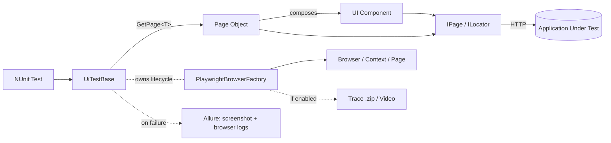

# UI Testing Architecture

Reference for the UI testing layer that wraps [Playwright for .NET](https://playwright.dev/dotnet/). Browser/context/page lifecycle, tracing, video, and failure diagnostics live in the framework (`CsharpTestAutomation.Framework.UI`); the page-object model lives in the application test project (`CsharpTestAutomation.Tests.UI`). Tests drive intent-revealing **page objects** that wrap Playwright's `IPage`/`ILocator`, compose reusable **components** for shared fragments, and assert with Playwright's web-first `Assertions.Expect(...)` plus **AwesomeAssertions**.

> **Design goals:** simple, extensible, and easy to support. Page objects stay thin, shared UI
> fragments are modeled as components (composition over inheritance), waits prefer auto-retrying
> web-first assertions over manual sleeps, and timeouts are configuration-driven rather than
> hard-coded.

> **Playwright version note:** this module uses Microsoft.Playwright with locators (not element
> handles), semantic locators (`GetByRole`, `GetByLabel`), and web-first assertions. The default
> Expect timeout is set once from configuration via
> `Assertions.SetDefaultExpectTimeout(PlaywrightTimeouts.ExpectTimeoutInMS)`.

## 1. Data Flow



`Test → UiTestBase.GetPage<T>() → Page Object → IPage → Browser`, with `PlaywrightBrowserFactory` owning the per-test browser/context/page (thread-safe for parallel runs) and `UiTestBase` capturing a screenshot and browser logs on failure. Tests obtain a page via `GetPage<MSLoginPage>()`, call intent-revealing actions, enforce readiness with `WaitUntilLoadedAsync()`, and assert with `Expect(...)` / AwesomeAssertions.

## 2. Component Table

| Type | Responsibility |
| --- | --- |
| `TestBase` | Root fixture (`[TestFixture]`, `[AllureNUnit]`). Owns the per-test `TestContainer` and `ScenarioCleanupActions`, runs `[SetUp]`/`[TearDown]`, and exposes overridable `OnSetUpAsync` / `OnTearDownAsync` hooks (no base call required). |
| `UiTestBase` | Base fixture for UI tests (`[Category("UI")]`). Owns the Playwright `Context`/`Page` via `PlaywrightBrowserFactory`, initializes them in `OnSetUpAsync`, captures a screenshot (and browser logs when `CaptureBrowserLogs` is `true`) on failure, then disposes context + browser. Exposes `GetPage<T>()`. |
| `BaseUIObject` | Shared base for **both** pages and components. Centralizes the `IPage`, strongly-typed `ExtendedConfiguration`, and the web-first `Expect(ILocator)` entry point. Its static constructor sets the global default Expect timeout from configuration. |
| `BaseUIView` | Base class for **full-page** objects. Declares the abstract `PageReadyLocator` readiness signal and provides `IsLoadedAsync()` (no wait), `WaitUntilLoadedAsync()` (waits up to `LongTimeoutInMS`), `GetPage<TPage>()` for post-navigation transitions, and the static `Create<TPage>(IPage)` factory. |
| `BaseUIComponent` | Base class for **reusable fragments** (nav bars, grids, dialogs, forms). Scoped to a `Root` locator so the same component can appear multiple times / across pages without ambiguity. Compose inside pages rather than inheriting. |
| Page object | Consuming-project class (e.g. `MSLoginPage`) deriving from `BaseUIView`. Wraps `IPage`, builds locators, exposes intent-revealing async actions, declares `PageReadyLocator`, and composes components. No navigation/readiness logic leaks into tests. |
| UI component | Consuming-project class (e.g. `SecondaryLoginForm`) deriving from `BaseUIComponent`. Builds child locators from `Root` and exposes focused actions (e.g. `SignInAsync`). |
| `PlaywrightBrowserFactory` | Static, thread-safe factory that initializes Playwright, launches the configured browser, and creates a context + page **per test** (keyed by test id). Applies viewport, proxy, HTTP credentials, video, and tracing from configuration; auto-saves traces and closes resources on disposal. |
| `PlaywrightTimeouts` | Facade exposing configuration-backed timeout values (browser start, navigation, actions, short/medium/long, expect) so timeouts can be tuned per environment without recompilation. |
| `BrowserType` | Supported browsers: `CHROMIUM`, `CHROME`, `MSEDGE`, `FIREFOX`, `SAFARI`. |
| `AllureExtensions` | Failure diagnostics: `CaptureScreenshotAsync(page, title)` and `CaptureBrowserLogsAsync(context, title)` attach to the Allure report. |
| `GlobalSetupFixture` | `[SetUpFixture]` for run-wide one-time setup/teardown and logging effective `appsettings` values. |

## 3. Page Object Model and Composition

Three small base classes keep the model consistent and thin:

```
BaseUIObject (IPage, configuration, Expect)
├── BaseUIView      → full pages (navigation + readiness + GetPage<T>)
└── BaseUIComponent → reusable fragments (scoped to a Root locator)
```

**Pages** own the whole screen — navigation and page-level readiness. They build locators from `Page`, expose intent-revealing actions, and **compose** components for shared fragments:

```csharp
public class MSLoginPage(IPage page) : BaseUIView(page)
{
    private readonly ILocator _accountInput = page.Locator("[name='loginfmt']");
    private readonly ILocator _nextButton = page.GetByRole(AriaRole.Button, new() { Name = "Next" });
    private readonly SecondaryLoginForm _secondaryLoginForm = new(page, page.Locator("body"));

    protected override ILocator PageReadyLocator => _accountInput;

    public async Task OpenAsync() => await Page.GotoAsync("<login url>");

    public async Task EnterAccountAsync(string email) => await _accountInput.FillAsync(email);

    public async Task ClickNextAsync() => await _nextButton.ClickAsync();

    public async Task HandleSecondaryLoginAsync(string username, string password) =>
        await _secondaryLoginForm.SignInAsync(username, password);
}
```

**Components** are scoped to a `Root` locator so they are isolated and reusable. Build child locators from `Root`; read page-level prompts from `Page` when they live outside the fragment:

```csharp
public class SecondaryLoginForm(IPage page, ILocator root) : BaseUIComponent(page, root)
{
    private readonly ILocator _usernameInput = root.Locator("#userNameInput");
    private readonly ILocator _passwordInput = root.Locator("#passwordInput");
    private readonly ILocator _submitButton = root.Locator("#submitButton");
    private readonly ILocator _yesButton = page.GetByRole(AriaRole.Button, new() { Name = "Yes" });

    public async Task SignInAsync(string username, string password)
    {
        await Expect(_usernameInput).ToBeVisibleAsync();
        await _usernameInput.FillAsync(username);
        await _passwordInput.FillAsync(password);
        await _submitButton.ClickAsync();
        await _yesButton.ClickAsync();
    }
}
```

**Obtaining pages.** Tests never `new` a page. `UiTestBase.GetPage<T>()` binds a page to the current `Page`; inside a page, `GetPage<TPage>()` returns the next page object after an action that already navigated (`return GetPage<NextPage>();`). Both delegate to `BaseUIView.Create<TPage>(IPage)`, which uses `Activator.CreateInstance(typeof(TPage), page)`, so a page only needs the conventional `(IPage page)` constructor.

**Locator and assertion conventions.**

- Prefer **semantic locators** (`GetByRole`, `GetByLabel`, `GetByText`) over brittle CSS/XPath.
- Use **web-first assertions** (`Expect(locator).ToBeVisibleAsync()`, etc.) — they auto-retry up to the Expect timeout — instead of manual `WaitForTimeout`/sleeps.
- Keep raw locator strings inside the page/component; tests speak only in intent-revealing methods.

## 4. Readiness Contract

Every `BaseUIView` declares a `PageReadyLocator` — a locator that becomes visible only once the page has finished loading (a unique heading or primary control). Two members consume it:

| Member | Waits? | Timeout | Use for |
| --- | --- | --- | --- |
| `IsLoadedAsync()` | No (snapshot) | — | Branching / optional state checks (`if (await page.IsLoadedAsync())`). |
| `WaitUntilLoadedAsync()` | Yes (web-first) | `PlaywrightTimeouts.LongTimeoutInMS` | Enforcing readiness after navigation; fails fast if the expected page did not load. |

`WaitUntilLoadedAsync()` deliberately uses the **long** timeout because full page loads usually take longer than the default Expect timeout used for individual element assertions. Call it right after `OpenAsync()` / a navigating action, then assert.

## 5. Lifecycle, Logging, and Allure

`PlaywrightBrowserFactory` owns the browser/context/page **per test** (keyed by test id, safe for parallel execution). `UiTestBase` wires it into the NUnit lifecycle:

- **Setup** (`OnSetUpAsync` → `InitializePlaywrightEnvironmentAsync`): initialize Playwright, create a context (optionally from a `storageState`), and open a page.
- **Teardown** (`OnTearDownAsync`): on failure, attach a **screenshot** and, when `CaptureBrowserLogs` is `true`, **browser logs** to Allure; then dispose the context (auto-saving a trace if `TraceEnabled`) and the browser.

Optional artifacts are produced by the factory based on configuration:

- **Tracing** (`TraceEnabled`): a Playwright trace `.zip` per context is written to `TraceDir` on context disposal (open with `playwright show-trace`).
- **Video** (`RecordVideoEnabled`): recorded to `RecordDir`.
- **Screenshots / browser logs**: captured by `UiTestBase` on failure and attached via `AllureExtensions`.

Allure suite/feature/story metadata is applied with attributes on the fixture and test (see the example below); `TestBase` is annotated `[AllureNUnit]` so Allure participates in the NUnit lifecycle. For the full set of required attributes across both API and UI tests, see `.copilot/instructions/tests.instructions.md`.

## 6. Configuration Reference

UI settings are bound from `CoreConfiguration` (extended by `ExtendedConfiguration`) via `AppConfiguration<T>` from `CsharpTestAutomation.Tests/appsettings.json`, overridable per environment through `appsettings.{Environment}.json`.

### Browser and capture

| Key | Type | Default | Description |
| --- | --- | --- | --- |
| `BrowserType` | `string` | `"CHROMIUM"` | One of `CHROMIUM`, `CHROME`, `MSEDGE`, `FIREFOX`, `SAFARI`. |
| `HeadlessMode` | `bool` | `true` | Run the browser headless. |
| `ViewportSize` | `ViewportSize` | `1280x720` | Default viewport (ignored when `PlaywrightDeviceName` is set). |
| `PlaywrightDeviceName` | `string` | `""` | Emulate a Playwright device profile when non-empty. |
| `PlaywrightSlowMotion` | `float` | `0` | Slow down operations by N ms (debugging). |
| `PlaywrightArgs` | `string` | `null` | Extra browser launch args, space-separated (e.g. `--disable-gpu --no-sandbox`). |
| `BypassCSP` | `bool` | `false` | Bypass Content-Security-Policy in the context. |
| `ProxyMode` | `bool` | `false` | Route the browser through `ProxyServer` when `true`. |
| `ProxyServer` | `string` | `http://localhost:8090` | Proxy server URL used when `ProxyMode` is `true`. |
| `HttpCredentials` | `HttpCredentials` | `null` | Default HTTP Basic credentials applied to the context. |
| `CaptureBrowserLogs` | `bool` | `false` | Attach browser console logs to Allure on failure. |
| `TraceEnabled` | `bool` | `false` | Record a Playwright trace per context, saved to `TraceDir`. |
| `TraceDir` | `string` | `<output>/Traces` | Output directory for trace `.zip` files. |
| `RecordVideoEnabled` | `bool` | `false` | Record video per context, saved to `RecordDir`. |
| `RecordDir` | `string` | `<output>/Videos` | Output directory for recorded video. |
| `ReportDir` | `string` | `<output>/Report` | Reporting output directory. |

### Timeouts (milliseconds)

Surfaced through `PlaywrightTimeouts` and applied to the context (navigation/action), assertions (expect), and the readiness contract (long).

| Key | Type | Default | Applied to |
| --- | --- | --- | --- |
| `BrowserStartTimeoutInMs` | `float` | `35000` | Browser launch. |
| `NavigationTimeoutInMs` | `float` | `35000` | Context default navigation timeout. |
| `ActionsTimeoutInMs` | `float` | `10000` | Context default action timeout. |
| `ShortTimeoutInMs` | `float` | `3000` | Ad-hoc short waits. |
| `MediumTimeoutInMs` | `float` | `6000` | Ad-hoc medium waits. |
| `LongTimeoutInMs` | `float` | `12000` | `WaitUntilLoadedAsync()` page-readiness wait. |
| `ExpectTimeoutInMs` | `float` | `6000` | Default web-first `Expect(...)` assertion timeout. |

### Example

```json
{
  "HeadlessMode": true,
  "BrowserType": "CHROMIUM",
  "CaptureBrowserLogs": false,
  "TraceEnabled": false,
  "RecordVideoEnabled": false
}
```

## 7. Example Test Fixture

`CsharpTestAutomation.Tests/Tests/UI/ExampleUiTests.cs` is the copy-me template. It demonstrates the full flow — `GetPage<T>()`, navigation, the readiness contract, composed page/component actions, and an assertion — wired with Allure metadata. The single test is `[Ignore]`d because it targets placeholder credentials and a placeholder URL.

```csharp
[AllureSuite("UI")]
[AllureFeature("Microsoft Entra ID Sign-in")]
public class ExampleUiTests : UiTestBase
{
    private const string AccountEmail = "example.user@contoso.com";
    private const string FederatedUsername = "CONTOSO\\example.user";
    private const string FederatedPassword = "placeholder-not-a-real-secret";

    [Test]
    [Ignore("Example template only: placeholder credentials and a placeholder sign-in URL.")]
    [AllureStory("User signs in through the Microsoft Entra ID login page")]
    [AllureSeverity(SeverityLevel.critical)]
    [AllureOwner("CPF QA")]
    [AllureDescription("End-to-end UI workflow: open the login page, enter the account, handle the federated login form, and verify the login page is dismissed.")]
    public async Task SignIn_WithValidAccount_DismissesLoginPage()
    {
        // Arrange
        MSLoginPage loginPage = GetPage<MSLoginPage>();

        // Act
        await loginPage.OpenAsync();
        await loginPage.WaitUntilLoadedAsync();
        await loginPage.EnterAccountAsync(AccountEmail);
        await loginPage.ClickNextAsync();
        await loginPage.HandleSecondaryLoginAsync(FederatedUsername, FederatedPassword);

        // Assert
        bool loginPageStillVisible = await loginPage.IsLoadedAsync();
        loginPageStillVisible.Should().BeFalse("a successful sign-in should navigate away from the login page");
    }
}
```

**Authoring checklist for a new UI test:**

1. Derive the fixture from `UiTestBase` and tag it with `[AllureSuite]` / `[AllureFeature]`.
2. Add a page object (`: BaseUIView`) per screen; declare its `PageReadyLocator`.
3. Extract shared fragments into components (`: BaseUIComponent`) and compose them in pages.
4. In the test: `GetPage<T>()` → navigate → `WaitUntilLoadedAsync()` → act → assert.
5. Prefer semantic locators and web-first `Expect(...)`; avoid manual sleeps.
6. Source real credentials/URLs from secure configuration / test data — never hard-code secrets.

For test-case design, required attributes, assertion style, and Definition of Done, see `.copilot/instructions/tests.instructions.md` — these rules apply to UI tests exactly as they apply to API tests and are not restated here.

## 8. Live-Application Verification with Playwright MCP

Before writing a page object or component for a new screen, verify locators against the running application rather than guessing from a design mock or a stale screenshot. Playwright MCP drives the real application and returns an accessibility snapshot, giving a ground-truth check that a semantic locator resolves to exactly one element before it is committed to a page object.

This is an authoring and diagnosis aid only. It never appears in committed test code, and it is never part of the CI run. See `AGENTS.md` for the full MCP routing policy and the semantic-locator preference order (`GetByRole` → `GetByLabel` → `GetByText` → `GetByTestId` → CSS as a last resort).

## 9. Extension Points

Natural places to grow the layer without changing its shape:

- **More pages/components** — add `BaseUIView` / `BaseUIComponent` subclasses in `CsharpTestAutomation.Tests/UI`; no framework change needed.
- **Authenticated sessions** — capture a `storageState` and pass it to `InitializePlaywrightEnvironmentAsync(storageState)` to skip repeated logins.
- **New browsers/devices** — driven entirely by `BrowserType` / `PlaywrightDeviceName` configuration.
- **Per-environment timeouts** — override the `*TimeoutInMs` keys in `appsettings.{Environment}.json`.

> For the API testing layer, see [`API_TESTING_ARCHITECTURE.md`](API_TESTING_ARCHITECTURE.md).

## 10. Revision History

Newest first. Bump the version and add a row whenever this document changes so future updates are easy to track. Keep maximum three rows, delete the rest.

| Version | Date | Summary |
| --- | --- | --- |
| 1.0 | 2026-09-25 | Initial version. |
